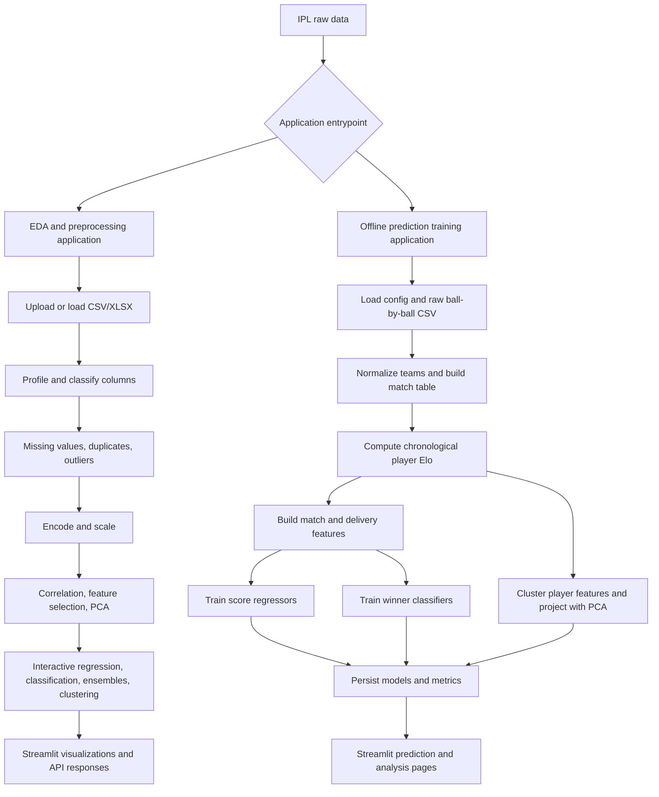
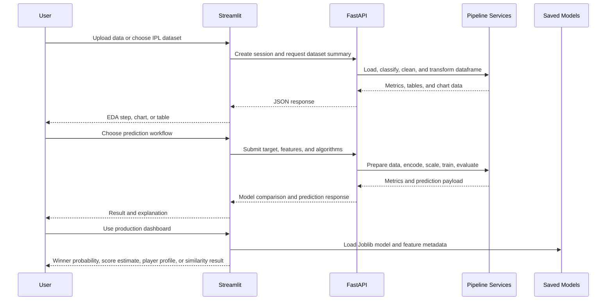

# IPL Machine Learning Project Documentation

## 1. Project Overview

This workspace contains an IPL analytics and machine-learning system with two complementary applications:

1. **IPL ML Lab / EDA application** in `ipl_prediction_project/`
   - Streamlit frontend.
   - FastAPI backend.
   - Interactive upload, profiling, cleaning, preprocessing, PCA, regression, classification, ensemble, and clustering workflows.
   - Session-specific intermediate datasets are serialized locally.

2. **IPL Prediction Model application** in `pythonmlproject/`
   - Streamlit prediction dashboard.
   - A reproducible offline training pipeline in `train.py`.
   - Match-winner classification, innings-score regression, player Elo analysis, clustering, PCA visualization, and SHAP explainability.
   - Trained models and feature metadata are saved as Joblib, CSV, Parquet, and NumPy artifacts.

The two applications use related IPL match and ball-by-ball data but have different responsibilities. The EDA application teaches and exposes the complete analytical process. The prediction application turns engineered historical features into reusable prediction models.

> `pythonmlproject/` contains the application pages, source packages, model artifacts, and training pipeline.

---

## 2. Seven Problem Statements

### Problem Statement 1: Explore and prepare IPL datasets for machine learning

IPL match and delivery data contains missing values, duplicate rows, mixed data types, categorical variables, outliers, and features with very different scales. A user needs an interactive workflow to understand the dataset, identify quality issues, clean it, encode categorical values, scale numerical values, and prepare train/test data.

**Expected output:** A validated and transformed dataset suitable for statistical analysis and model training.

**Implemented in:** `ipl_prediction_project/backend/services/cleaning.py`, `analysis.py`, `preprocessing.py`, and `pca_service.py`.

### Problem Statement 2: Predict the final first-innings score

Given the match context and the state of an innings, estimate the final first-innings score. This supports live score projection and comparison of different regression models.

**Inputs may include:** Current over, cumulative runs, cumulative wickets, current run rate, venue, season, and overs limit.

**Target:** `final_score` or an aggregated `first_inning_total`.

**Implemented in:** `pythonmlproject/src/data/features.py`, `src/models/score_predictor.py`, and the EDA backend regression/ensemble services.

### Problem Statement 3: Predict the match winner

Given two teams, toss information, venue, season context, historical head-to-head performance, venue performance, and Elo-based strength indicators, estimate whether Team 1 will win.

**Target:** `team1_won`, a binary value derived from `winner == team1`.

**Implemented in:** `pythonmlproject/src/data/features.py` and `src/models/match_winner.py`.

### Problem Statement 4: Predict whether a team successfully defends its total

Determine whether the team batting first wins the match, using toss and team context. This is a classification formulation of the strategic question: does the first-innings total get defended or chased successfully?

**Target:** `defended`:

- `1`: the team batting first is the winner.
- `0`: the chasing team is the winner.

**Implemented in:** `ipl_prediction_project/backend/services/classification_service.py`.

### Problem Statement 5: Predict whether a batsman scores at least fifty runs

Aggregate delivery-level runs by match and batsman, then classify whether the batsman reaches the 50-run milestone.

**Target:** `scored_fifty`, where total batsman runs are at least 50.

**Implemented in:** `ipl_prediction_project/backend/services/classification_service.py`.

### Problem Statement 6: Discover player roles and find similar IPL players

Player performance is multidimensional. Batsmen can be compared using runs, balls faced, strike rate, and boundary percentage. Bowlers can be compared using wickets, economy, bowling average, and balls bowled. The system should discover groups of similar players and return nearest neighbors within a group.

**Expected output:** Cluster labels, cluster profiles, a two-dimensional PCA projection, and similar-player results.

**Implemented in:** `ipl_prediction_project/backend/services/unsupervised_service.py` and `pythonmlproject/train.py`.

### Problem Statement 7: Explain model predictions and compare competing algorithms

A prediction is more useful when users can compare multiple algorithms and understand which features influence the result. The project therefore trains several model families, reports evaluation metrics, exposes prediction probabilities or score estimates, and computes SHAP feature importance for the winner-classification workflow.

**Expected output:** Comparative metric tables, model predictions, coefficient views where available, learning curves, and SHAP-based feature importance.

**Implemented in:** `pythonmlproject/src/models/match_winner.py`, `score_predictor.py`, `train.py`, and the Streamlit pages.

---

## 3. Overall Theoretical Flow



### 3.1 Data layers

The system works with two granularities:

| Data level | Typical source | Main use |
|---|---|---|
| Match level | `ipl_matches.csv` or the normalized match table | Winner classification, toss/venue analysis, match history |
| Delivery level | `ipl_ball_by_ball.csv` and processed variants | Score forecasting, batsman milestones, player statistics |
| Player level | Derived Elo and aggregate statistics | Player ranking, clustering, similarity search |

### 3.2 EDA application flow

1. The user uploads a CSV/XLSX file or selects an IPL dataset.
2. The backend creates a session identifier and stores the original dataframe.
3. The application identifies numerical, categorical, date, boolean, and constant columns.
4. Missing values are summarized and an imputation recommendation is produced.
5. Duplicates are counted and can be removed.
6. Numerical outliers are detected with IQR or Z-score rules and can be kept, capped, or removed.
7. Categorical columns are label-encoded or one-hot encoded; numerical columns can be standardized, min-max scaled, or robust scaled.
8. Correlation, distribution, univariate, bivariate, and multivariate views are generated.
9. Mutual information and variance are used as feature-selection signals.
10. PCA transforms numerical features into principal components and reports explained variance.
11. The processed dataframe is passed to optional supervised, ensemble, or unsupervised workflows.
12. The Streamlit frontend renders tables, metrics, charts, and educational explanations for each step.

### 3.3 Offline prediction-training flow

1. Load paths, aliases, hyperparameters, and random seeds from `config.yaml`.
2. Validate the raw IPL CSV.
3. Normalize historical team names such as Delhi Daredevils to Delhi Capitals.
4. Build a match-level dataframe and remove unusable no-result or tie records where required.
5. Compute player Elo ratings chronologically.
6. Build match-winner features, including toss indicators, encoded teams and venue, season index, historical head-to-head wins, venue wins, and team Elo values.
7. Build over-by-over score features from first-innings deliveries.
8. Split score data into training and test sets and train four regressors.
9. Split match data with stratification and train eleven classifiers.
10. Build player-level feature vectors, scale them, run K-Means and DBSCAN, and create a two-dimensional PCA projection.
11. Compute SHAP values for the classifier explanation workflow.
12. Save processed data and model artifacts for the Streamlit pages.

---

## 4. Algorithms and Methods Used

### 4.1 Data understanding and statistical analysis

| Method | Purpose | Implementation detail |
|---|---|---|
| Descriptive statistics | Summarize count, mean, spread, minimum, maximum, and quantiles | Pandas dataframe summaries |
| Data-type classification | Separate numerical, categorical, date, boolean, and constant fields | Type inspection in `analysis.py` |
| Missing-value analysis | Quantify null count and percentage per column | `isna()` counts and percentages |
| Mean, median, and mode imputation | Replace missing values according to type and user choice | Numeric mean/median; categorical mode |
| Duplicate detection | Identify repeated rows | Pandas `duplicated()` and `drop_duplicates()` |
| IQR outlier detection | Detect values outside the Tukey fences | Lower fence $Q_1 - 1.5IQR$ and upper fence $Q_3 + 1.5IQR$ |
| Z-score outlier detection | Detect values more than three standard deviations from the mean | $z = (x - \mu)/\sigma$ and $|z| > 3$ |
| Pearson correlation | Measure linear association between numeric variables | Correlation matrix and ranked pairs |
| Mutual information | Estimate nonlinear dependence between features and a target | `mutual_info_classif` or `mutual_info_regression` |

### 4.2 Encoding and scaling

- **Label encoding:** Converts categorical values to integer codes. It is used by the interactive modeling services and the production feature builder.
- **One-hot encoding:** Represents each category as a separate binary column where selected by the preprocessing workflow.
- **StandardScaler:** Transforms a feature to approximately zero mean and unit variance. This is important for Logistic Regression, SVM, KNN, and distance-based clustering.
- **MinMaxScaler:** Maps features to a bounded range and is used for player-feature preparation in the training pipeline.
- **RobustScaler:** Provides a scaling option less sensitive to extreme values by using median and interquartile spread.

### 4.3 Principal Component Analysis

PCA creates orthogonal directions that capture decreasing amounts of variance. For a centered feature matrix $X$, the transformation can be represented as:

$$
Z = XW
$$

where $W$ contains the selected principal directions. The application reports the explained variance ratio and cumulative explained variance, then uses the projected coordinates for two-dimensional or three-dimensional visualization.

The implementation excludes ID-like columns, imputes remaining numerical nulls with medians, and can preserve a target column alongside the projection.

### 4.4 Regression algorithms

The project uses regression to estimate a continuous score.

| Algorithm | Theory and role |
|---|---|
| Linear Regression | Models the target as a weighted sum of the input features. It provides a simple baseline and interpretable coefficients. |
| Ridge Regression / RidgeCV | Adds an $L_2$ penalty to reduce coefficient magnitude and multicollinearity. `RidgeCV` selects the regularization strength from configured candidates using cross-validation. |
| Lasso Regression / LassoCV | Adds an $L_1$ penalty. It can shrink weak coefficients to zero and therefore performs feature selection. |
| Decision Tree Regressor | Recursively partitions feature space into regions with similar target values. The interactive backend limits tree depth to control overfitting. |
| Random Forest Regressor | Averages predictions from many randomized decision trees, reducing variance. |
| Gradient Boosting Regressor | Builds trees sequentially, where each new tree focuses on residual errors from the previous ensemble. |
| AdaBoost Regressor | Sequentially combines weak learners while emphasizing difficult observations. |
| XGBoost Regressor | Uses regularized gradient-boosted trees with learning-rate, depth, subsampling, and estimator-count controls. |

The production score pipeline uses Linear Regression, RidgeCV, LassoCV, and XGBoost. The EDA service additionally exposes a Decision Tree, and the ensemble service exposes Random Forest, Gradient Boosting, XGBoost, and AdaBoost.

### 4.5 Classification algorithms

Classification is used for winner, defend/chase, and batsman-fifty outcomes.

| Algorithm | Theory and role |
|---|---|
| Logistic Regression | Estimates class probability using a logistic link function. It is a strong interpretable baseline for binary targets. |
| K-Nearest Neighbors | Classifies a sample using the labels of nearby scaled observations. The value of $k$ can be tuned. |
| Gaussian Naive Bayes | Applies Bayes' rule while assuming conditionally independent Gaussian-distributed features. |
| Support Vector Machine | Finds a separating boundary with maximum margin; the project uses an RBF kernel for nonlinear separation. |
| Decision Tree Classifier | Learns hierarchical feature rules using splits such as Gini impurity. |
| Bagging Classifier | Fits multiple base estimators on resampled data and aggregates their predictions. |
| Random Forest Classifier | A bagged collection of randomized decision trees. |
| AdaBoost Classifier | Sequentially focuses on misclassified observations and combines weak learners. |
| Gradient Boosting Classifier | Builds an additive sequence of trees that reduce classification loss. |
| XGBoost Classifier | Regularized, efficient gradient boosting for binary classification. |
| Stacking Classifier | Combines Logistic Regression, Random Forest, and Gradient Boosting base models with an XGBoost final estimator. |

The production winner pipeline trains all eleven listed classifiers. The interactive classification service exposes Logistic Regression, Decision Tree, SVM, and Gaussian Naive Bayes.

### 4.6 Ensemble learning

The ensemble service provides separate regression and classification endpoints. Its goal is to compare several tree-ensemble families on the same prepared target and select or display the strongest model according to evaluation metrics. Ensemble models are useful when relationships between venue, teams, toss, and score are nonlinear.

### 4.7 Clustering and similarity search

- **K-Means:** Assigns scaled player vectors to $k$ centroids by minimizing within-cluster squared Euclidean distance. The training pipeline uses $k=6$; the interactive service allows the cluster count to be changed.
- **DBSCAN:** Forms dense regions using `eps` and `min_samples`, while labeling isolated observations as noise (`-1`). It does not require the number of clusters in advance.
- **Silhouette score:** Measures whether a point is closer to its own cluster than to another cluster. Higher values generally indicate better separation.
- **Davies-Bouldin index:** Measures average similarity between each cluster and its most similar alternative cluster. Lower values are generally better.
- **Euclidean nearest-neighbor search:** After clustering, similar players are found by Euclidean distance in standardized feature space, restricted to the selected player's cluster.

### 4.8 Elo rating

The training pipeline computes chronological player ratings using the Elo update rule:

$$
E_A = \frac{1}{1 + 10^{(R_B - R_A)/400}}
$$

$$
R_A' = R_A + K(S_A - E_A)
$$

The configured initial rating is 1500 and the K-factor is 32. Because the available match data identifies the Player of the Match rather than complete player rosters, the implementation tracks Elo for players appearing as Player of the Match and uses a 1500 opponent proxy. This makes the rating a useful exploratory signal, but it should not be interpreted as a complete player-vs-player Elo system.

### 4.9 SHAP explainability

SHAP values estimate each feature's contribution to a model output relative to a baseline prediction. The training pipeline computes SHAP values for the winner-classification workflow and stores the result in a NumPy artifact. Mean absolute SHAP values are aggregated to rank global feature influence.

---

## 5. Feature Engineering

### 5.1 Match-winner features

The production classifier uses the following features:

- Encoded Team 1, Team 2, and toss winner.
- Whether the toss winner chose to bat first.
- Whether the toss winner is Team 1.
- Encoded venue.
- Season index, calculated relative to 2008.
- Historical head-to-head wins for Team 1.
- Historical Team 1 wins at the venue.
- Team 1 and Team 2 Elo values.

Historical head-to-head and venue counts are calculated using only rows before the current match after chronological sorting. This reduces future-information leakage.

### 5.2 Score-prediction features

Each row represents an over-state from first innings data:

- Current over.
- Cumulative runs.
- Cumulative wickets.
- Current run rate.
- Encoded venue.
- Season index.
- Overs limit.
- Final innings score as the target.

### 5.3 Player features

The EDA clustering service derives:

- Batsmen: total runs, balls faced, boundaries, strike rate, and boundary percentage.
- Bowlers: wickets, economy, bowling average, and balls bowled.

The production training pipeline uses Elo rating, match count, Player of the Match count, and win rate for player clustering.

---

## 6. Evaluation Strategy

### Regression metrics

- **MAE:** Average absolute prediction error. Lower is better.
- **RMSE:** Square root of average squared error. It penalizes large errors more strongly than MAE.
- **$R^2$:** Fraction of target variance explained by the model. Higher is generally better.
- **Adjusted $R^2$:** Adjusts $R^2$ for sample size and number of predictors.

The formula used for adjusted $R^2$ is:

$$
\bar{R}^2 = 1 - (1 - R^2)\frac{n - 1}{n - p - 1}
$$

where $n$ is the number of test observations and $p$ is the number of features.

### Classification metrics

- **Accuracy:** Fraction of correct predictions.
- **Precision:** Fraction of predicted positives that are correct.
- **Recall:** Fraction of actual positives found by the model.
- **F1 score:** Harmonic mean of precision and recall.
- **ROC-AUC:** Ranking quality across classification thresholds.
- **Confusion matrix:** Counts true positives, true negatives, false positives, and false negatives.

The production classifier uses a stratified 80/20 train/test split. The EDA modeling services use the same test-size convention and retain trained objects in process memory for interactive prediction.

---

## 7. Artifacts and Outputs

### EDA application

- Session data: temporary serialized dataframes under `ipl_prediction_project/backend/temp_data/`.
- API responses: JSON-serializable metrics, records, and Plotly figure dictionaries.
- Runtime models: stored in in-memory dictionaries for the active process.

### Prediction application

| Artifact | Meaning |
|---|---|
| `data/processed/elo_ratings.csv` | Chronological player Elo and summary statistics |
| `data/processed/features.parquet` | Match-level engineered features |
| `data/processed/score_features.parquet` | Over-level score-prediction features |
| `data/processed/clusters.csv` | Player cluster labels and PCA coordinates |
| `models/score_*.joblib` | Four saved score regressors |
| `models/match_winner_*.joblib` | Saved winner classifiers |
| `models/classif_scaler.joblib` | Scaler used by scale-sensitive classifiers |
| `models/classif_features.joblib` | Winner-classification feature order |
| `models/score_features.joblib` | Score-regression feature order |
| `models/label_encoders.joblib` | Team and venue encoders |
| `models/shap_values.npy` | Stored SHAP values when the SHAP step succeeds |

---

## 8. User-Facing Application Flow



---

## 9. Running the Projects

### Shared environment

Install Python 3.12, open the workspace root (the directory containing this document), and run:

```powershell
.\setup_venv.bat
```

This creates the root `.venv` and installs combined dependencies from the root `requirements.txt`. Project-level requirements files include the shared file for compatibility.

### EDA and API application

From `ipl_prediction_project/`, run `run.bat both` to start the FastAPI backend and Streamlit frontend. The launcher bootstraps and uses the workspace-level `.venv`.

### Prediction application

From `pythonmlproject/`, use `run_train.ps1` to train models or `run_app.ps1` to start the dashboard. Both launchers use the same workspace-level `.venv`. Training must complete before prediction pages can use newly generated models.

To start the merged dashboard from the workspace root, run `run_home.bat`.

---

## 10. Important Assumptions and Limitations

1. **Historical prediction is not live sports intelligence.** The models depend on the available historical columns and do not automatically account for injuries, current form, weather, pitch condition, playing XI changes, or live match events.
2. **Categorical label encoding is ordinal-looking.** Integer codes are convenient for the current implementation, but they can introduce artificial ordering. One-hot encoding or target-aware encodings may be preferable for some models.
3. **The Elo implementation is an approximation.** It tracks Player of the Match appearances and uses a league-average opponent proxy because complete roster-level match participation is not available in the source table.
4. **Some interactive models use in-memory state.** Restarting the FastAPI process removes those session-trained model objects.
5. **The EDA regression and classification services use fallback column discovery.** This helps arbitrary uploaded datasets run, but a production deployment should enforce a schema contract for reliable target semantics.
6. **The dataset may contain future seasons or incomplete records.** The configured range reaches 2026, so training results should be checked against the actual coverage and data collection date.
7. **Evaluation is primarily holdout-based.** Cross-validation utilities exist in parts of the codebase, but reported holdout metrics should not be treated as a guarantee of future-match performance.
8. **Team aliases are essential.** Historical names must be normalized consistently before aggregating team statistics or encoding teams.

---

## 11. Recommended Extension Path

For a stronger research-grade system, the next improvements would be:

1. Replace the POM-based Elo approximation with roster-aware team and player ratings.
2. Use a strict chronological validation split for every prediction target, in addition to the current random holdout.
3. Add calibration analysis for winner probabilities.
4. Add explicit schemas and data validation checks for uploaded datasets.
5. Compare label encoding with one-hot or learned embeddings.
6. Track model versions, training data timestamps, and feature definitions with each saved artifact.
7. Monitor drift when new IPL seasons are added.

---

## 12. Source Map

- EDA API entrypoint: `ipl_prediction_project/backend/main.py`
- EDA frontend entrypoint: `ipl_prediction_project/frontend/app.py`
- Cleaning and outliers: `ipl_prediction_project/backend/services/cleaning.py`
- EDA statistics: `ipl_prediction_project/backend/services/analysis.py`
- PCA: `ipl_prediction_project/backend/services/pca_service.py`
- Interactive regression: `ipl_prediction_project/backend/services/regression_service.py`
- Interactive classification: `ipl_prediction_project/backend/services/classification_service.py`
- Interactive ensembles: `ipl_prediction_project/backend/services/ensemble_service.py`
- Player clustering: `ipl_prediction_project/backend/services/unsupervised_service.py`
- Production training orchestration: `pythonmlproject/train.py`
- Production features: `pythonmlproject/src/data/features.py`
- Elo ratings: `pythonmlproject/src/data/elo.py`
- Winner models: `pythonmlproject/src/models/match_winner.py`
- Score models: `pythonmlproject/src/models/score_predictor.py`
- Configuration: `pythonmlproject/config.yaml`
